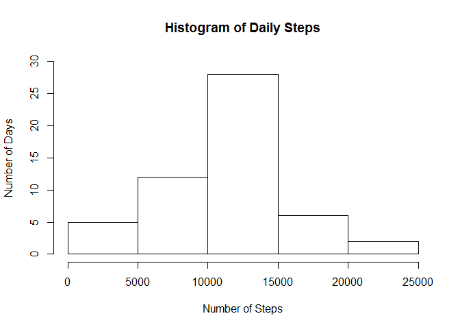
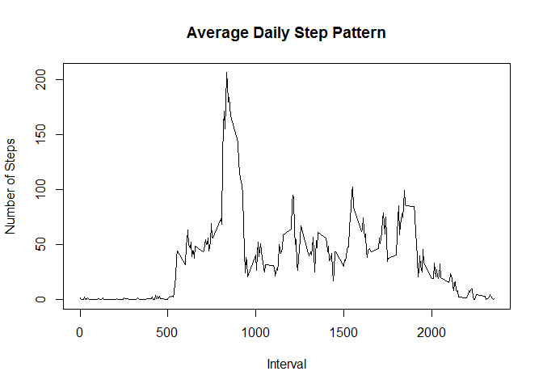
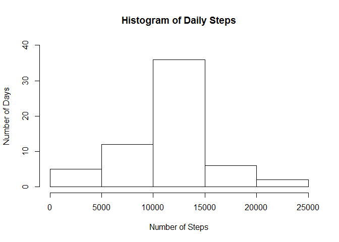

# Reproducible Research: Peer Assessment 1


First of all we need to load and preprocess the data.  The date is stored as a factor so needs to be changed to a date


```r
setwd("~/GitHub/RepData_PeerAssessment1")
if(!file.exists("./activity/activity.csv")){
       unzip("activity.zip")} 
#load first file into a variable if not already present
if(!"activity" %in% ls()){
    activity <- read.csv("./activity/activity.csv")}
activity$date <- as.Date( activity$date, format = '%Y-%m-%d' )
```

# What is mean total number of steps taken per day?
A histogram of the number the steps per day shows the variation in activity

```r
totsteps<-aggregate(activity$steps,list(date=activity$date),FUN="sum")
names(totsteps)[2]<-"steps"
hist(totsteps$steps, xlab="Number of Steps", main="Histogram of Daily Steps", ylab="Number of Days",ylim=c(0,30))
```

 


* The average number of steps are:

```r
summary(totsteps$steps)['Median']
```

```
## Median 
##  10760
```

```r
summary(totsteps$steps)['Mean']
```

```
##  Mean 
## 10770
```
## What is the average daily activity pattern?


```r
#remove the NAs from the data for the next phase to plot the data
rmNA <- na.omit(activity)
dailysteps<-aggregate(rmNA$steps,list(interval=rmNA$interval),FUN="mean")
names(dailysteps)[2]<-"avsteps"
head(dailysteps)
```

```
##   interval   avsteps
## 1        0 1.7169811
## 2        5 0.3396226
## 3       10 0.1320755
## 4       15 0.1509434
## 5       20 0.0754717
## 6       25 2.0943396
```

```r
summary(dailysteps)
```

```
##     interval         avsteps       
##  Min.   :   0.0   Min.   :  0.000  
##  1st Qu.: 588.8   1st Qu.:  2.486  
##  Median :1177.5   Median : 34.113  
##  Mean   :1177.5   Mean   : 37.383  
##  3rd Qu.:1766.2   3rd Qu.: 52.835  
##  Max.   :2355.0   Max.   :206.170
```

```r
plot(dailysteps$interval,dailysteps$avsteps,type="l",xlab="Interval",ylab="Number of Steps",main="Average Daily Step Pattern")
```

 


```r
maxint<-dailysteps[dailysteps$avsteps == max(dailysteps$avsteps),]
```
The maximum average number of steps **(206.1698113)** is at interval **835**

## Imputing missing values

There are **2304** NA data records in the original data.
We can fill these in to give us a comprehensive data set.  The approach I have taken is to use the value of the mean for that interval as a substitute.


```r
newactivity<-activity
for (i in 1:nrow(newactivity)){
    if(is.na(newactivity$steps[i])){
        newactivity$steps[i]<-dailysteps[which(dailysteps$interval==newactivity$interval[i]),]$avsteps
    }
}
head(newactivity)
```

```
##       steps       date interval
## 1 1.7169811 2012-10-01        0
## 2 0.3396226 2012-10-01        5
## 3 0.1320755 2012-10-01       10
## 4 0.1509434 2012-10-01       15
## 5 0.0754717 2012-10-01       20
## 6 2.0943396 2012-10-01       25
```

```r
sum(is.na(newactivity))
```

```
## [1] 0
```
A histogram of the number the steps per day shows the variation in activity

```r
totsteps2<-aggregate(newactivity$steps,list(date=newactivity$date),FUN="sum")
names(totsteps2)[2]<-"steps"
hist(totsteps2$steps, xlab="Number of Steps", main="Histogram of Daily Steps", ylab="Number of Days",ylim=c(0,40))
```

 


* The average number of steps are:

```r
summary(totsteps2$steps)['Median']
```

```
## Median 
##  10770
```

```r
summary(totsteps2$steps)['Mean']
```

```
##  Mean 
## 10770
```
As the mean has been used to impute the missing values it has not changed, however, the median has increased as there is now more data.  With the median and mean now equivalent it is closer to a normal distribution.


## Are there differences in activity patterns between weekdays and weekends?
Create new factors and levels then create plot

```r
actdays<-newactivity
actdays$day<-factor(weekdays(actdays$date))
levels(actdays$day)<-list(Weekday=c("Monday","Tuesday","Wednesday","Thursday","Friday"),
                         Weekend=c("Saturday","Sunday"))
dailysteps2<-aggregate(actdays$steps,list(interval=actdays$interval,weekdays=actdays$day),FUN="mean")
names(dailysteps2)[3]<-"avsteps"
head(dailysteps2)
```

```
##   interval weekdays    avsteps
## 1        0  Weekday 2.25115304
## 2        5  Weekday 0.44528302
## 3       10  Weekday 0.17316562
## 4       15  Weekday 0.19790356
## 5       20  Weekday 0.09895178
## 6       25  Weekday 1.59035639
```

```r
library(lattice)
xyplot(dailysteps2$avsteps~dailysteps2$interval|dailysteps2$weekdays,type="l",xlab = "Interval",ylab="Number of Steps",layout=c(1,2))
```

 


